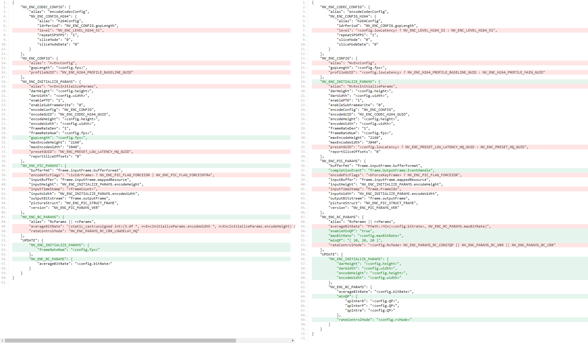

# Comparison of Unity & Unreal4 


## NVIDIA API 

Summaries of NVIDIA API encoder settings:

**Unity:**

```
    NV_ENC_INITIALIZE_PARAMS 
        alias = "nvEncInitializeParams";
        encodeWidth = <config.width>;
        encodeHeight = <config.height>;
        darWidth = <config.width>;
        darHeight = <config.height>;
        encodeGUID = NV_ENC_CODEC_H264_GUID;
        presetGUID = NV_ENC_PRESET_LOW_LATENCY_HQ_GUID;
        frameRateNum = <config.fps>;
        frameRateDen = 1;
        enablePTD = 1;
        reportSliceOffsets = 0;
        enableSubFrameWrite = 0;
        encodeConfig = NV_ENC_CONFIG;
        maxEncodeWidth = 3840;
        maxEncodeHeight = 2160;
        gopLength = <config.fps>;

    NV_ENC_CONFIG
        alias = "nvEncConfig"
        profileGUID = NV_ENC_H264_PROFILE_BASELINE_GUID;
        gopLength = <config.fps>;

    NV_ENC_RC_PARAMS 
        alias: "RcParams || rcParams"
        rateControlMode = NV_ENC_PARAMS_RC_CBR_LOWDELAY_HQ;
        averageBitRate =
            (static_cast<unsigned int>(5.0f *
            nvEncInitializeParams.encodeWidth *
            nvEncInitializeParams.encodeHeight) / (m_width * m_height)) * 100000;
        
            
    NV_ENC_CODEC_CONFIG \
        alias = "encodeCodecConfig"
        NV_ENC_CONFIG_H264
            alias = "h264Config"
            idrPeriod = NV_ENC_CONFIG.gopLength
            sliceMode = 0
            sliceModeData = 0
            repeatSPSPPS = 1
            level = NV_ENC_LEVEL_H264_51
        
    NV_ENC_PIC_PARAMS
        version = NV_ENC_PIC_PARAMS_VER;
        pictureStruct = NV_ENC_PIC_STRUCT_FRAME;
        inputBuffer = frame.inputFrame.mappedResource;
        bufferFmt = frame.inputFrame.bufferFormat;
        inputWidth = NV_ENC_INITIALIZE_PARAMS.encodeWidth;
        inputHeight = NV_ENC_INITIALIZE_PARAMS.encodeHeight;
        outputBitstream = frame.outputFrame;
        inputTimeStamp = <frameCount>;
        encodePicFlags = <isIdrFrame> ? NV_ENC_PIC_FLAG_FORCEIDR | NV_ENC_PIC_FLAG_FORCEINTRA;

    UPDATE
        NV_ENC_INITIALIZE_PARAMS
            frameRateNum = <config.fps>;
        NV_ENC_RC_PARAMS
            averageBitRate = <config.bitRate>;

```
        
**Unreal:**

```
    NV_ENC_INITIALIZE_PARAMS 
        alias = "NvEncInitializeParams"
        encodeWidth = <config.width>;
        encodeHeight = <config.height>;
        darWidth = <config.width>;
        darHeight = <config.height>;
        encodeGUID = NV_ENC_CODEC_H264_GUID;
        presetGUID = <config.lowLatency> ? NV_ENC_PRESET_LOW_LATENCY_HQ_GUID : NV_ENC_PRESET_HQ_GUID; 
        frameRateNum = <config.fps>;
        frameRateDen = 1;
        enablePTD = 1;
        reportSliceOffsets = 0;
        enableSubFrameWrite = 0;
        encodeConfig = NV_ENC_CONFIG;
        maxEncodeWidth = 3840;
        maxEncodeHeight = 2160;

    NV_ENC_CONFIG 
        alias = "NvEncConfig"
        profileGUID = <config.lowLatency> ? NV_ENC_H264_PROFILE_BASELINE_GUID : NV_ENC_H264_PROFILE_MAIN_GUID; 
        gopLength = <config.fps>;

    NV_ENC_RC_PARAMS 
        alias: "RcParams || rcParams"
        averageBitRate = FMath::Min(Config.Bitrate, NV_ENC_RC_PARAMS.maxBitRate);
        rateControlMode: <config.RcMode> = NV_ENC_PARAMS_RC_CONSTQP || NV_ENC_PARAMS_RC_VBR || NV_ENC_PARAMS_RC_CBR;
        enableMinQP: true;
        minQP = { 20, 20, 20 };
        maxBitRate = <config.maxBitRate>;

            
    NV_ENC_CODEC_CONFIG \
        alias = "encodeCodecConfig"
        NV_ENC_CONFIG_H264
            alias = "h264Config"
            idrPeriod = NV_ENC_CONFIG.gopLength;
            sliceMode = 0;
            sliceModeData = 0;
            repeatSPSPPS = 1;
            level = <config.lowLatency> ? NV_ENC_LEVEL_H264_52 : NV_ENC_LEVEL_H264_51; 

    NV_ENC_PIC_PARAMS
        version = NV_ENC_PIC_PARAMS_VER;
        pictureStruct = NV_ENC_PIC_STRUCT_FRAME;
        inputBuffer = frame.inputFrame.mappedResource;
        bufferFmt = frame.inputFrame.bufferFormat;
        inputWidth = NV_ENC_INITIALIZE_PARAMS.encodeWidth;
        inputHeight = NV_ENC_INITIALIZE_PARAMS.encodeHeight;
        outputBitstream = frame.outputFrame;
        inputTimeStamp = frame.FrameIdx;
        completionEvent = frame.OutputFrame.EventHandle;
        encodePicFlags = <bForceKeyFrame> ? NV_ENC_PIC_FLAG_FORCEIDR;


    UPDATE
        NV_ENC_INITIALIZE_PARAMS
            encodeWidth = <config.width>;
            encodeHeight = <config.height>;
            darWidth = <config.width>;
            darHeight = <config.height>;
        NV_ENC_RC_PARAMS
            averageBitRate = <config.bitRate>;
            rateControlMode = <config.rcMode>;
            minQP
                qpIntra = <config.QP>;
                qpInterP = <config.QP>;
                qpInterB = <config.QP>;

```

**Compare**

The two included JSON files can be compared via: https://jsoncompare.org

**Unreal:**

Unreal also uses a common interface. An IDR frame will be forced if frame type `== webrtc::VideoFrameType::kVideoFrameKey`


## Differences

**Low latency**

Unreal exposes a configuration option for "low latency" which sets some particular settings to the equivalent Unity defaults:

```
NV_ENC_CODEC_CONFIG
    NV_ENC_CONFIG_H264
        level = NV_ENC_LEVEL_H264_51 -> NV_ENC_LEVEL_H264_52
NV_ENC_INITIALIZE_PARAMS
    presetGUID = NV_ENC_PRESET_HQ_GUID -> NV_ENC_PRESET_LOW_LATENCY_HQ_GUID 
NV_ENC_CONFIG
    profileGUID = NV_ENC_H264_PROFILE_MAIN_GUID -> NV_ENC_H264_PROFILE_BASELINE_GUID 

```

**Forcing IDR frames**

Both encoders force an IDR frame when receiving `webrtc::kVideoFrameKey`, however Unity has a bitwise operator which may accidentally cause an Intra, rather than IDR, frame: `picParams.encodePicFlags = NV_ENC_PIC_FLAG_FORCEIDR | NV_ENC_PIC_FLAG_FORCEINTRA;`

**FPS**

The NVIDIA default FPS value is 30 - Unreal sets some sthis only during initialisation, and Unity allows changes via UpdateSetttings method:

```
    if (nvEncInitializeParams.frameRateNum != m_frameRate)
    {
        // nvcodec do not allow a framerate over 240
        const uint32_t kMaxFramerate = 240;
        uint32_t targetFramerate = std::min(m_frameRate, kMaxFramerate);
        nvEncInitializeParams.frameRateNum = targetFramerate;
        settingChanged = true;
    }
```

**Average bitrate**

Unity calculates an average bitrate from the initial incoming width and height during initialisation, then later allows this to be changed via the UpdateSettings method:

```
# init
averageBitRate = (static_cast<unsigned int>(5.0f *, nvEncInitializeParams.encodeWidth *, nvEncInitializeParams.encodeHeight) / (m_width * m_height)) * 100000
```
```
# update
if (nvEncConfig.rcParams.averageBitRate != m_targetBitrate)
{
    nvEncConfig.rcParams.averageBitRate = m_targetBitrate;
    settingChanged = true;
}
```

This possibly could be the source of the unusual ramping behaviour observed in chrome://webrtc-internals.

**Rate control mode**

Unity uses a deprecated rate control mode `NV_ENC_PARAMS_RC_CBR_LOWDELAY_HQ`:

https://docs.nvidia.com/video-technologies/video-codec-sdk/pdf/Deprecation_Notices.pdf

Unreal exposes 3 rate control modes and Bitrate and MaxBitrate parameters which are set to averageBitRate and maxBitRate. The modes are:

* `NV_ENC_PARAMS_RC_CONSTQP` requires `NV_ENC_RC_PARAMS::constQP` to be set
* `NV_ENC_PARAMS_RC_CBR` uses only `NV_ENC_RC_PARAMS::averageBitRate`
* `NV_ENC_PARAMS_RC_VBR` uses `NV_ENC_RC_PARAMS::averageBitRate` and `NV_ENC_RC_PARAMS::maxBitRate`

During initialisation and update, additional flags for minimum quantisation (compression) are also set:

```
    # custom params

    rateControlMode = <config.RcMode> = NV_ENC_PARAMS_RC_CONSTQP || NV_ENC_PARAMS_RC_VBR || NV_ENC_PARAMS_RC_CBR
    maxBitRate = <config.maxBitRate>

    # additional flags

    enableMinQP = true
    minQP = { 20, 20, 20 }
```

